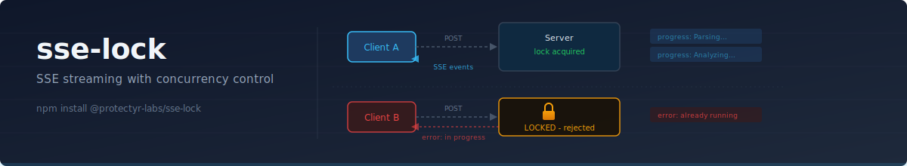
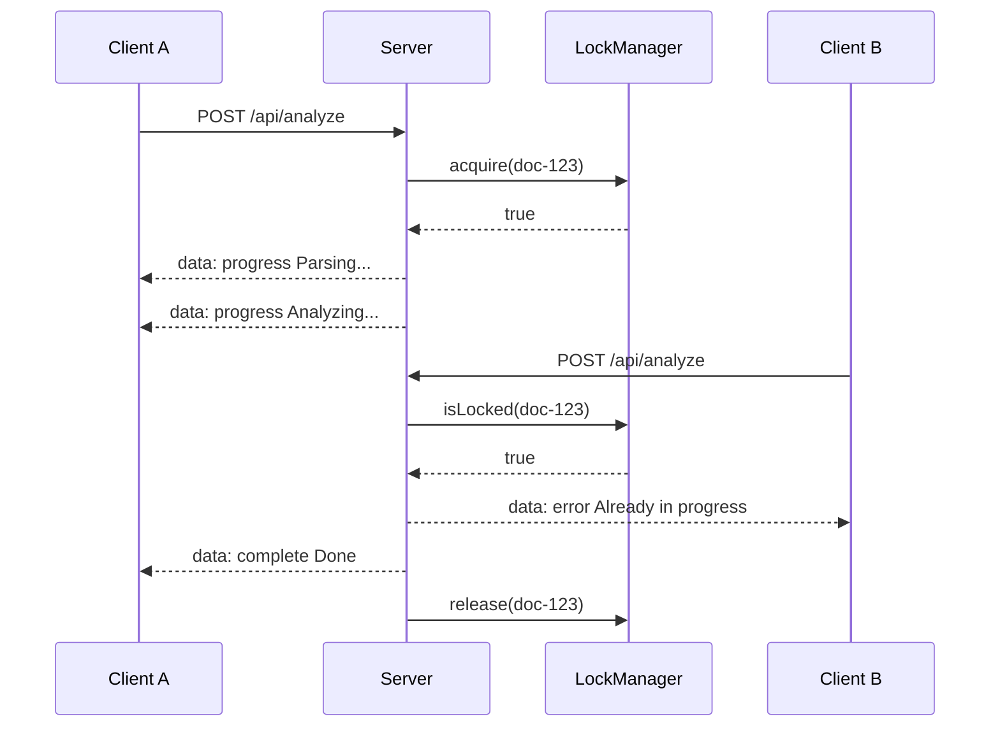

<p align="center">
  
</p>

<p align="center">
  Stream progress to the client. Prevent duplicate runs.
</p>

<p align="center">
  <a href="https://github.com/protectyr-labs/sse-lock/actions/workflows/ci.yml"></a>
  <a href="LICENSE"></a>
  <a href="https://www.typescriptlang.org/"></a>
  <a href="https://www.npmjs.com/package/@protectyr-labs/sse-lock">= 18"></a>
  <a href="https://www.npmjs.com/package/@protectyr-labs/sse-lock"></a>
</p>

---

## Quick Start

```bash
npm install @protectyr-labs/sse-lock
```

```typescript
import { createSseStream, createInMemoryLockManager } from '@protectyr-labs/sse-lock';

const lockManager = createInMemoryLockManager();

// Next.js App Router example
export async function POST(request: Request) {
  const { documentId } = await request.json();
  return createSseStream(
    async (send) => {
      send('progress', 'Parsing document...');
      const data = await parseDocument(documentId);
      send('progress', 'Running analysis...');
      const result = await analyzeData(data);
      send('complete', 'Done', result);
    },
    { lockManager, resourceId: documentId },
  );
}
// Second request while first is running => rejected immediately
```

## Why This Exists

You have an API endpoint that kicks off a long-running LLM call or analysis pipeline. You need three things: stream progress events back to the client so the UI stays responsive, prevent a second request from starting the same operation while the first is still running, and clean up the lock automatically if something fails. This library handles all three in a single function call with zero dependencies.

## Architecture



## Why SSE Over WebSockets

Server-Sent Events are the right fit for "start a job, watch it run, get a result." SSE uses plain HTTP with no upgrade handshake, works through standard proxies and load balancers, and the client reads the response body as a stream with no special library. WebSockets would be overkill here. They shine for bidirectional communication like chat or collaborative editing, but an analysis endpoint only sends data in one direction.

## Use Cases

**AI analysis endpoints** -- User clicks "Analyze" which triggers a 60-second Claude call. Stream progress ("Loading data...", "Running analysis...") back to the UI. If they click again, reject the duplicate.

**Report generation** -- Generate a complex report that takes 30+ seconds. Stream status updates. Lock prevents two reports being generated simultaneously for the same resource.

**Background job monitoring** -- Long-running job starts via API. Client opens SSE connection to receive progress events. Lock ensures the job is not started twice.

## API

| Function | Purpose |
|----------|---------|
| `createSseStream(handler, opts?)` | Returns a `Response` with SSE headers and streaming body |
| `formatEvent(type, message, result?)` | Format a single SSE event string |
| `createInMemoryLockManager()` | In-memory lock for dev/testing |

### LockManager Interface

```typescript
interface LockManager {
  isLocked(resourceId: string): Promise<boolean>;
  acquire(resourceId: string): Promise<boolean>;
  release(resourceId: string): Promise<void>;
  releaseWithError(resourceId: string, error: string): Promise<void>;
}
```

The interface is deliberately minimal. Different deployments need different backends:

| Backend | When to use |
|---------|------------|
| In-memory (`Map`) | Local development, tests, single-process apps |
| PostgreSQL/MySQL | Multi-process deployments with an existing database |
| Redis | High-throughput, distributed systems with TTL support |

Implement 10-20 lines of adapter code for your stack. The core library stays at zero dependencies.

### Without Locking

Omit options to use pure SSE streaming with no concurrency control:

```typescript
return createSseStream(async (send) => {
  send('progress', 'Working...');
  send('complete', 'Done', { value: 42 });
});
```

## Design Decisions

**Lock release on error.** If a handler throws and the lock is not released, that resource is permanently locked until a server restart. The library catches all handler errors, calls `releaseWithError()` so the lock manager can store the error for debugging, streams the error to the client, and closes the stream cleanly.

**`data: {JSON}\n\n` format.** Follows the [SSE specification](https://html.spec.whatwg.org/multipage/server-sent-events.html). Parseable by `EventSource`, parseable by `fetch` + `ReadableStream`, and human-readable in curl and browser dev tools.

**POST over EventSource.** Most use cases involve sending a request body (document IDs, parameters). The browser `EventSource` API only supports GET, so the library targets `fetch`-based consumers where the client controls retry logic explicitly.

## Limitations

- **Single-process in-memory lock** -- implement `LockManager` with Redis/Postgres for multi-server deployments
- **No TTL on locks** -- if the process dies without releasing, the lock is stuck (in-memory version). Database lock managers should implement TTL.
- **No retry headers** -- rejected requests get an error event, caller decides retry logic
- **No backpressure** -- if the client reads slowly, events buffer in memory
- **Race condition window** -- the `isLocked` + `acquire` sequence is not atomic in the in-memory implementation. Use atomic operations (`INSERT ... ON CONFLICT` or `SETNX`) in production lock managers.

> [!NOTE]
> The in-memory lock manager is intended for development and testing only. For production multi-process deployments, implement the `LockManager` interface with your database or Redis.

## Origin

Built for [OTP2](https://github.com/protectyr-labs), where AI-powered security assessments run 30-120 second analysis pipelines per document. Each assessment streams progress events to the dashboard while preventing duplicate runs. Extracted as a standalone library because the pattern is useful anywhere you have long-running server operations with a browser client waiting for results.

## See Also

- [webhook-resume](https://github.com/protectyr-labs/webhook-resume) -- pause workflows and wait for human decisions

## License

MIT
